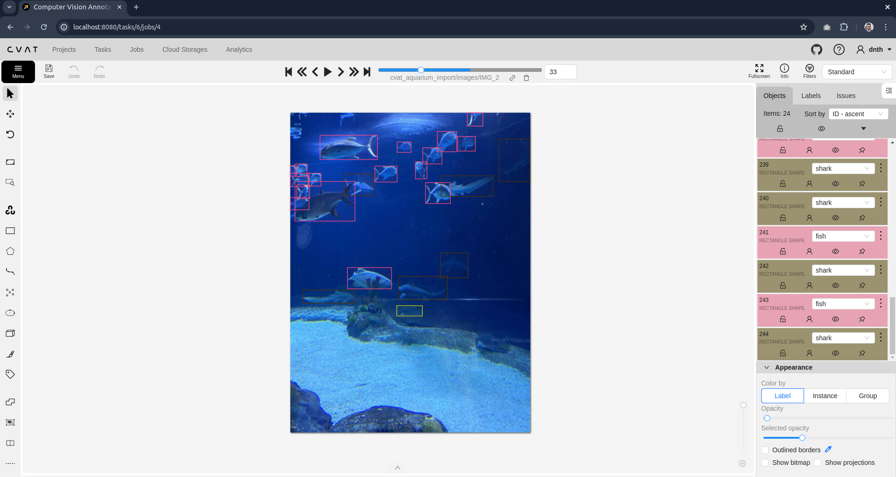
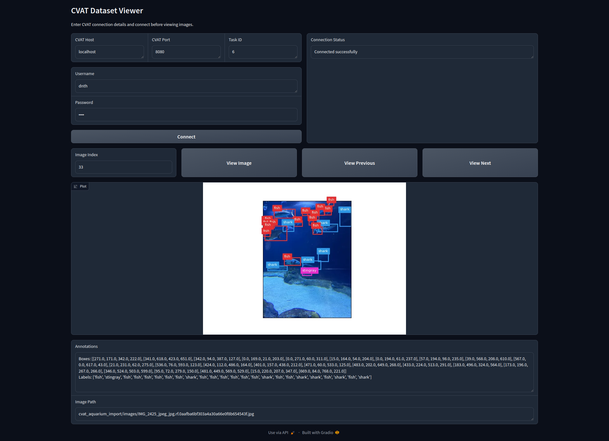

# CVAT-Gradio

This repository contains code to load CVAT annotated image into Gradio using the CVAT SDK.

## Installation
Install the required packages using the following command:

```
pip install 'cvat_sdk[pytorch]' gradio
```

## Load Dataset into CVAT
Next, load your dataset into CVAT and annotate it. Optionally, you can load publicly available and annotated dataset from Roboflow or other sources.

In my setup, I loaded the [Aquarium dataset](https://public.roboflow.com/object-detection/aquarium) from Roboflow. The dataset consists of bounding boxe annotations for the following classes:

+ fish 
+ jellyfish 
+ penguins 
+ sharks 
+ puffins 
+ stingrays 
+ starfish



## Pulling Dataset from CVAT

We can use the CVAT SDK to pull the dataset from CVAT. The following code snippet shows how to pull the dataset from CVAT:

```python
from cvat_sdk import make_client

client = make_client(host, port=port, credentials=(user, password))

dataset = TaskVisionDataset(client, task_id,
            target_transform=ExtractBoundingBoxes(include_shape_types=["rectangle"])
          )
```

## Running the Gradio App

Finally, we can run the Gradio app using the following code snippet:

```python
python run_gradio.py
```
